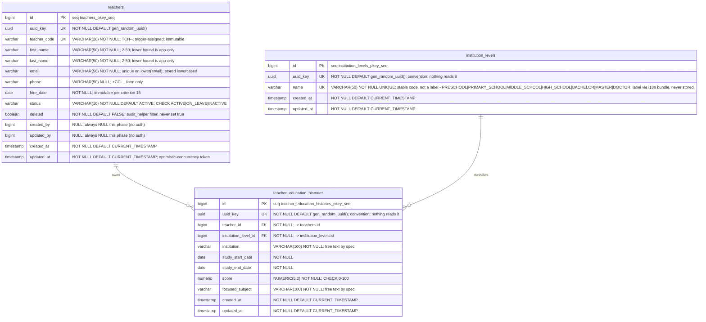

# sample-project — Entity Relationship Diagram

3 of 3 tables registered — full detail, single ungrouped diagram (below the split threshold).

This is the cumulative entity-relationship picture across every feature built for this service. It is maintained by `/architect` as part of each feature's own PR — new or changed tables are merged in as features land. It is not a substitute for a feature's own `database.md`: that document holds the design rationale, the normalization findings and the migration plan; this is the combined picture of every table the service has.

**Deliberately absent: the level-label translations.** `institution_levels.name`
stores a code; its English and Indonesian labels live in i18n bundle JSON files
(`i18n/institution_level/{en-US,id-ID}.json`), not in a table. Nothing joins on
or filters by a label, so there is no entity to draw here — its absence is the
design, not an omission. See FEAT-001's `database.md` for the dictionary itself.

## Tables by feature

| Feature | Tables added/changed |
| :--- | :--- |
| [FEAT-001](feature/FEAT-001/database.md) | `institution_levels`, `teachers`, `teacher_education_histories` |

## Cardinality

| Relationship | Cardinality | Note |
| :--- | :--- | :--- |
| `teachers` → `teacher_education_histories` | 1 → 0..n | Zero rows is a deliberate valid state (criterion 13). Each row belongs to exactly one teacher. |
| `institution_levels` → `teacher_education_histories` | 1 → 0..n | Each row names exactly one level (`NOT NULL`). A level may classify zero rows. |

No other relationship exists, and that is deliberate — the spec's non-goals drop
every Subject / Class / Student link. **`teachers` does not carry an
`institution_level_id`**: the level is per-education-row, not per-teacher. A
teacher with three schools has three levels.

Both FKs default to `NO ACTION` — no `ON DELETE` clause is written. That is
implicit rather than chosen: hard-deleting a teacher is unreachable (criterion
19), so no cascade is ever exercised, and an operational `DELETE FROM teachers`
failing loudly is the preferable behaviour.
