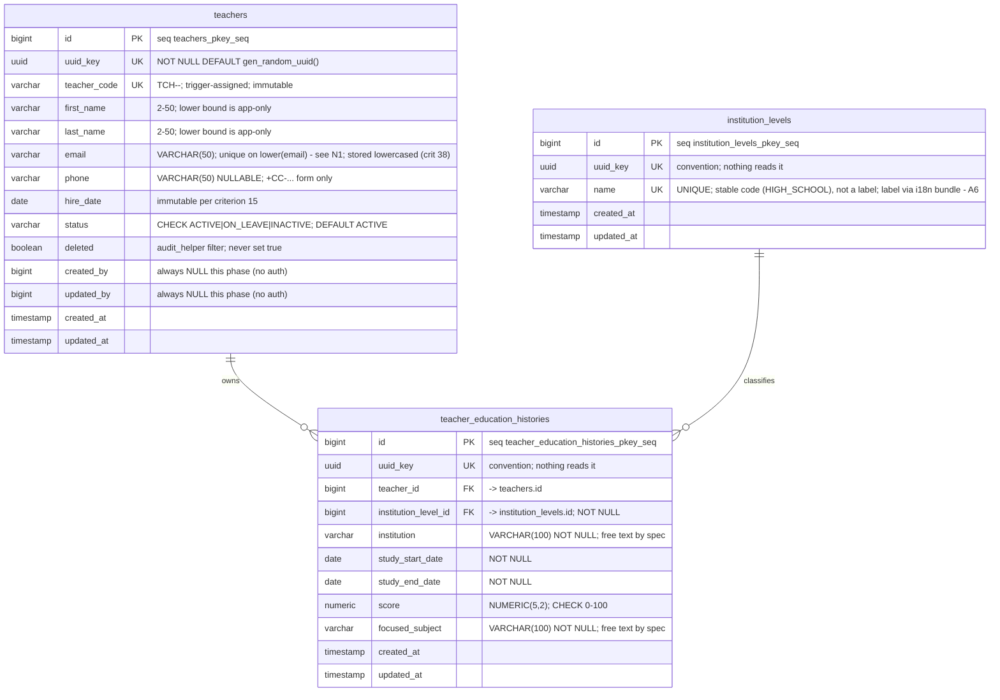

# FEAT-001 — Database Design

Three tables, one migration, one seed. No audit table.

Produced through the schema-designer gate (draft ERD → normalization review →
batched migration plan). The ERD, the normalization findings and the migration
plan are all recorded below as the design authority's output; the DDL is the
handoff to whoever implements the migration, not a step toward writing it here.

## Scope

Designs the persisted shape for Teacher CRUD: the `teachers` table, its owned
`teacher_education_histories`, and the `institution_levels` lookup. Covers
columns, keys, constraints, indexes, `teacher_code` generation, seed data, and
the migration plan.

Does **not** cover: the Go struct/DAO layer (see `architecture.md`), the HTTP
surface, or anything linked to Subject / Class / Student (dropped by spec
non-goals).

## Conventions inherited

The DDL below follows the house migration style recorded in
`knowledge/nexcommon-reuse-survey.md` §5 — sequence-backed `BIGINT id`,
compact constraint names, `idx_<compact>_<col>` index names, `sql-migrate`
headers.

Three columns appear that the spec never asked for. Each exists for a
mechanical reason, not a preference:

| Column | On | Why it exists |
| :--- | :--- | :--- |
| `uuid_key` | all three tables | House convention (`database-design-standards`: every table carries one) **and**, on `teachers`, a hard requirement — `audit_helper`'s before-snapshot query selects `uuid_key` by literal name. On the other two tables nothing reads it today; it is convention, kept because it is cheap and a stable external identifier is worth owning before an API shape exists. |
| `deleted` | `teachers` **only** | `GetDataForAuditByIDTx` filters `deleted = false` for every non-delete action. Forced by the library. |

`updated_at` (on `teachers`) doubles as the optimistic-concurrency token
(criteria 35–36) — see the column notes. No separate `version` column exists.

`uuid_key` is `UUID NOT NULL DEFAULT gen_random_uuid()`. This needs
`pgcrypto` on PostgreSQL < 13; on 13+ it is built in. Confirm the target
version before the migration runs — see the migration plan's Gate 0.1.

**Where `deleted` is deliberately absent:** `teacher_education_histories` is
**hard-deleted**, not soft-deleted — spec criterion 27 requires that deleting an
education row "removes that row only", and the Education history section says
rows are "freely editable and deletable after creation". There is no soft-delete
state for these rows, so the column would be permanently `false`.

Note the asymmetry this creates, which is intentional: `teachers` has a
`deleted` column it will never set (criterion 19 — no hard delete is
reachable), purely so `audit_helper` can filter on it. `teachers` soft-deletes
via `status = 'INACTIVE'`, not via `deleted`.

> **If `teacher_education_histories` is ever registered with `audit_helper`,
> it must gain a `deleted` column first** — the before-snapshot query filters
> on it by literal name and will fail at runtime without it. Recorded here
> because the reuse survey originally stated `deleted` was on both tables; that
> was wrong and has been corrected (survey §1, v1.1).

---

## ERD



### Cardinality

| Relationship | Cardinality | Note |
| :--- | :--- | :--- |
| `teachers` → `teacher_education_histories` | 1 → 0..n | Zero rows is a deliberate valid state (criterion 13). Each row belongs to exactly one teacher. |
| `institution_levels` → `teacher_education_histories` | 1 → 0..n | Each row names exactly one level (`NOT NULL`). A level may classify zero rows. |

No other relationship exists, and that is deliberate — the spec's non-goals drop
every Subject / Class / Student link. **`teachers` does not carry an
`institution_level_id`**: the level is per-education-row, not per-teacher. A
teacher with three schools has three levels.

Both FKs default to `NO ACTION` — no `ON DELETE` clause is written. That is
implicit rather than chosen: hard-deleting a teacher is unreachable
(criterion 19), so no cascade is ever exercised, and an operational
`DELETE FROM teachers` failing loudly is the preferable behaviour.

CHECK constraints cannot be expressed in Mermaid; they are in the DDL below.

---

## Normalization review

Run as the schema-designer gate's advisory phase. Recorded in full, including
the findings that were accepted rather than fixed, so none of them get
rediscovered later as surprises.

| # | Finding | Severity | Disposition |
| :--- | :--- | :--- | :--- |
| N1 | Email uniqueness was case-sensitive | **HIGH** | **Fixed** — functional unique index on `lower(email)` |
| N11 | Reuse survey claimed `deleted` on both tables | MEDIUM | **Fixed** — survey v1.1 scopes it to `teachers` |
| N2 | `teachers.deleted` is a dead second delete flag | MEDIUM | **Kept** (library-forced); documented + `COMMENT ON COLUMN` |
| N3 | `idx_teachers_deleted` had no selectivity | LOW | **Fixed** — dropped |
| N9 | (resolved by design choice) `updated_at`, not a `version` column, is the optimistic-concurrency token | LOW | **Fixed** — no `version` column exists; the stale-write check compares `updated_at`, matching the nexcommon convention (see survey §7). The prior `CHECK (version >= 1)` is gone with the column. |
| N4 | `uuid_key` unused on two tables | LOW | **Kept** — house convention, cheap, documented |
| N5 | `teacher_code` is derivable from `(id, hire_date)` | LOW | **Kept** — deliberate denormalization, safe because `hire_date` is immutable |
| N6 | `institution` / `focused_subject` are free text | LOW | **Kept** — spec-mandated |
| N7 | `institution_levels` is effectively a keyed enum | LOW | **Kept** — confirmed decision, revisit only if it gains attributes |
| N8 | Should education rows soft-delete? | — | **No** — hard delete is correct per criterion 27 |
| N10 | Future end date unenforceable in the DB | LOW | **Accepted** — a `CHECK` cannot use `CURRENT_DATE` |

### N1 — why it mattered, in full

`uq_teachers_email` was a plain `UNIQUE` on a `VARCHAR`, which in PostgreSQL is
case-sensitive. `Alice@school.edu` and `alice@school.edu` were therefore **two
distinct rows, both insertable**. That breaks:

- **Criterion 3** — "creating a teacher whose email already exists → rejected".
  A case variant is the same mailbox.
- **Criterion 30** — the spec requires email uniqueness to hold "under
  concurrency" and to be "enforced in the database, not only in application
  code". The database was only enforcing half of it, silently.

This is the one finding that was not shippable. The fix is a functional unique
index rather than the `citext` extension — cheaper, no extension dependency, and
the column stays `VARCHAR` and Go-friendly:

```sql
CREATE UNIQUE INDEX IF NOT EXISTS uq_teachers_email_lower
    ON teachers (lower(email));
```

**Consequence for the query path:** `WHERE email = $1` no longer matches the
index. Lookups and the duplicate pre-check must be written
`WHERE lower(email) = lower($1)`. The unique violation `23505` is still the
enforcement point — the pre-check exists only to produce the field-level `Email`
error message, and that mapping is unchanged.

### N2 — the dead `deleted` column

`deleted` is always `false` (no hard delete is reachable) and exists only
because `audit_helper` filters on it. The real soft-delete lives in `status`.
Any query author who reaches for `deleted = true` gets an empty result forever.

It cannot be removed without patching the shared library, so it is kept and
documented at the column:

```sql
COMMENT ON COLUMN teachers.deleted IS
    'Never set to true. Present only because nexcommon audit_helper filters on it. Use status = ''INACTIVE'' for deactivation.';
```

### N7 — is `institution_levels` over-built?

Recorded because someone will ask. Today the table is `id, uuid_key, name,
timestamps` — functionally a keyed enum. A `CHECK`-constrained
`institution_level VARCHAR(30)` column would carry the same semantics with no
join and no seed.

It stays a table because the decision was made explicitly with the user, the
3NF-correct home for a repeating attribute value *is* a lookup, and it becomes
retrospectively right the moment a level gains any attribute (a rank, a
category). If a future pass wants to collapse it, that is a deliberate
migration, not a cleanup.

---

## Table: `institution_levels`

Lookup for the `institution_level` field the spec mandates on each education
row. The field is a reference to this table rather than a free-text column, and
the table is **seeded only**, with no CRUD surface of its own.

It hangs off `teacher_education_histories`, not off `teachers` — see the ERD
notes above. Not audited, so its `uuid_key` is convention only.

**`name` holds a stable code, not a display string.** The seeded values are
`PRESCHOOL`, `PRIMARY_SCHOOL`, `MIDDLE_SCHOOL`, `HIGH_SCHOOL`, `BACHELOR`,
`MASTER`, `DOCTOR` — uppercase ASCII, which is what the spec's field-constraints
table caps at 50 ASCII for this column. The human-readable label for each code
is **not stored in the database**; it is i18n bundle content keyed by the code
itself (`architecture.md` A6, dictionary in the next section). Keeping the
column a code rather than a label is what lets a third language arrive as a new
JSON file instead of a migration.

```sql
CREATE EXTENSION IF NOT EXISTS pgcrypto;   -- PostgreSQL < 13 only; see Gate 0.1

CREATE SEQUENCE IF NOT EXISTS institution_levels_pkey_seq;
CREATE TABLE IF NOT EXISTS "institution_levels" (
    id                      BIGINT NOT NULL     DEFAULT nextval('institution_levels_pkey_seq'::regclass),
    uuid_key                UUID NOT NULL       DEFAULT gen_random_uuid(),
    name                    VARCHAR(50) NOT NULL,
    created_at              TIMESTAMP WITHOUT TIME ZONE NOT NULL DEFAULT CURRENT_TIMESTAMP,
    updated_at              TIMESTAMP WITHOUT TIME ZONE NOT NULL DEFAULT CURRENT_TIMESTAMP,
    CONSTRAINT pk_institutionlevels_id PRIMARY KEY (id),
    CONSTRAINT uq_institutionlevels_uuidkey UNIQUE (uuid_key),
    CONSTRAINT uq_institutionlevels_name UNIQUE (name)
);
```

No `CHECK` constraint pins `name` to the seven codes. The table is seeded-only
and has no write surface, so the constraint would guard against a write path
that does not exist; the seed statement below is the enforcement point, and
Gate 1.13 checks the dictionary and the seed agree. A `CHECK` becomes worthwhile
the day this lookup gains a CRUD surface, which is a separate feature (A4).

#### Why the code, not a surrogate, is the join key for translations

The dictionary is keyed on the **code string**, not on `id` or `uuid_key`.
Keying on `id` is tempting — it is already the PK — but `id` is a
sequence-backed surrogate assigned at seed time, so the same level could get a
different `id` in a rebuilt database while the dictionary stayed fixed, and the
translation would silently detach. The code is the stable identifier across
environments; that is what an i18n message ID has to be.

---

## Table: `teachers`

```sql
CREATE SEQUENCE IF NOT EXISTS teachers_pkey_seq;
CREATE TABLE IF NOT EXISTS "teachers" (
    id                      BIGINT NOT NULL     DEFAULT nextval('teachers_pkey_seq'::regclass),
    uuid_key                UUID NOT NULL       DEFAULT gen_random_uuid(),
    teacher_code            VARCHAR(20) NOT NULL,
    first_name              VARCHAR(50) NOT NULL,
    last_name               VARCHAR(50) NOT NULL,
    email                   VARCHAR(50) NOT NULL,
    phone                   VARCHAR(50) NULL,
    hire_date               DATE NOT NULL,
    status                  VARCHAR(10) NOT NULL DEFAULT 'ACTIVE',
    deleted                 BOOLEAN NOT NULL DEFAULT FALSE,
    created_by              BIGINT NULL,
    updated_by              BIGINT NULL,
    created_at              TIMESTAMP WITHOUT TIME ZONE NOT NULL DEFAULT CURRENT_TIMESTAMP,
    updated_at              TIMESTAMP WITHOUT TIME ZONE NOT NULL DEFAULT CURRENT_TIMESTAMP,
    CONSTRAINT pk_teachers_id PRIMARY KEY (id),
    CONSTRAINT uq_teachers_uuidkey UNIQUE (uuid_key),
    CONSTRAINT uq_teachers_teachercode UNIQUE (teacher_code),
    CONSTRAINT ck_teachers_status CHECK (status IN ('ACTIVE', 'ON_LEAVE', 'INACTIVE'))
);

-- Case-insensitive uniqueness (N1). This REPLACES a plain UNIQUE (email).
CREATE UNIQUE INDEX IF NOT EXISTS uq_teachers_email_lower
    ON teachers (lower(email));

CREATE INDEX IF NOT EXISTS idx_teachers_status ON teachers (status);

COMMENT ON COLUMN teachers.deleted IS
    'Never set to true. Present only because nexcommon audit_helper filters on it. Use status = ''INACTIVE'' for deactivation.';
```

### Column notes

**`teacher_code`** — the spec's `Teacher_ID` (`TCH-2026-001`). Named
`teacher_code` so the surrogate primary key can be plain `id` and foreign keys
read unambiguously. Generation is covered below.

**`status`** — the spec's three-value set. Note it is **not** the SRD's: SRD §5
specifies `ACTIVE, INACTIVE, ON_LEAVE` and §4.1 says
`Active, On Leave, Terminated`. The spec supersedes both — `Terminated` does not
exist, and `Inactive` is the soft-delete state. `VARCHAR(10)` + `CHECK` rather
than a Postgres `ENUM` type: adding a status later is an `ALTER TABLE ... DROP
CONSTRAINT / ADD CONSTRAINT`, no type migration.

**`email` uniqueness is the enforcement point** (criteria 3 and 30, and now 38),
via `uq_teachers_email_lower`. The spec v10 field-constraints section makes the
email **persisted lowercased** (criterion 38), so the API normalizes to lowercase
before writing and the stored value agrees with the `lower(email)` index rather
than leaning on the index alone. See N1 — the application-level pre-check is a
UX nicety for the error message, not the guarantee, and must query
`lower(email) = lower($1)` to use the index.

**Optimistic concurrency via `updated_at`, not a `version` column**
(criteria 35–36). The spec leaves the mechanism to `/architect`; the chosen
convention is the nexcommon one — compare the `updated_at` the client read
against the row's current `updated_at` in a conditional `UPDATE`. No `version`
column exists. A client cannot bypass the check by omitting the value: the
expected `updated_at` is matched against the row the `UPDATE` targets, so an
omitted value matches nothing (criterion 36). Enforcement shape:

```sql
UPDATE teachers
   SET <fields>, updated_at = CURRENT_TIMESTAMP
 WHERE id = $1 AND updated_at = $client_updated_at;
```

Zero rows affected means a stale write. The service must read back the current
record and return it alongside the conflict so the losing administrator can
re-fetch (criterion 35). The check is server-side by construction (criterion 36).
The error returned is the library's `error.ErrDataLocked` (`E-4-CMD-DTO-007`,
HTTP 400, names the field via `errFieldNameConverter`) — see the reuse survey
§7. This is the team's shared concurrency error, not one this feature invents.

**`updated_at` on real change only** (criterion 17). Not enforceable by the
UPDATE above, which sets it unconditionally. The service must diff the incoming
values against the current row and **skip the UPDATE entirely** when nothing
changed — a no-op save writes no row, changes no timestamp, and therefore writes
no audit entry either. Postgres triggers are not used: the diff has to happen in
Go regardless, because the audit entry depends on it.

**`created_by` / `updated_by`** — house audit columns, present for convention.
With no authentication they will always be `NULL`; see the audit section.

---

## Table: `teacher_education_histories`

```sql
CREATE SEQUENCE IF NOT EXISTS teacher_education_histories_pkey_seq;
CREATE TABLE IF NOT EXISTS "teacher_education_histories" (
    id                      BIGINT NOT NULL DEFAULT nextval('teacher_education_histories_pkey_seq'::regclass),
    uuid_key                UUID NOT NULL DEFAULT gen_random_uuid(),
    teacher_id              BIGINT NOT NULL,
    institution_level_id    BIGINT NOT NULL,
    institution             VARCHAR(100) NOT NULL,
    study_start_date        DATE NOT NULL,
    study_end_date          DATE NOT NULL,
    score                   NUMERIC(5,2) NOT NULL,
    focused_subject         VARCHAR(100) NOT NULL,
    created_at              TIMESTAMP WITHOUT TIME ZONE NOT NULL DEFAULT CURRENT_TIMESTAMP,
    updated_at              TIMESTAMP WITHOUT TIME ZONE NOT NULL DEFAULT CURRENT_TIMESTAMP,
    CONSTRAINT pk_teachereducationhistories_id PRIMARY KEY (id),
    CONSTRAINT uq_teachereducationhistories_uuidkey UNIQUE (uuid_key),
    CONSTRAINT fk_teachereducationhistories_teacher FOREIGN KEY (teacher_id)
        REFERENCES teachers (id),
    CONSTRAINT fk_teachereducationhistories_level FOREIGN KEY (institution_level_id)
        REFERENCES institution_levels (id),
    CONSTRAINT ck_teachereducationhistories_score CHECK (score >= 0 AND score <= 100),
    CONSTRAINT ck_teachereducationhistories_daterange CHECK (study_end_date >= study_start_date)
);

CREATE INDEX IF NOT EXISTS idx_teachereducationhistories_teacherid
    ON teacher_education_histories (teacher_id);
CREATE INDEX IF NOT EXISTS idx_teachereducationhistories_teacherid_enddate
    ON teacher_education_histories (teacher_id, study_end_date DESC);
```

### Column notes

**No unique business key on education rows — deliberately.** Overlapping date
ranges are permitted, including two rows at the *same* institution, so
`(teacher_id, institution, study_start_date)` must **not** be declared unique.
Recorded so nobody "fixes" it later.

**`score` is `NUMERIC(5,2)`, and that is not stylistic.** Success criterion 25
requires a score to round-trip exactly — "3.75 stored reads back as 3.75, with
no floating-point drift". `REAL`/`DOUBLE PRECISION` cannot guarantee that. In Go
this maps to a decimal type, **not** `float64` — a `float64` round-trip through
the driver reintroduces exactly the drift the criterion forbids.

**Criterion 40 — reject, not round.** Spec v10 adds: a score with more than 2
decimal places is **rejected, not rounded**. `NUMERIC(5,2)` alone would *silently
round* `87.125` → `87.13`, which violates criterion 40. So the column type
guarantees the round-trip (criterion 25), but the **2-decimal ceiling is enforced
by the DTO validator**, which rejects finer precision before it reaches the
column. The column cannot express the rejection on its own; the validator is not
optional here.

**The score range is enforced twice, deliberately.** The `CHECK` (criterion 28)
is the guarantee; the DTO validator produces the field-level error message the
criterion asks for. A bare `23514` violation is not a usable error.

**`study_end_date` not in the future** (criterion 29) has **no constraint here**
and cannot have one — Postgres requires `CHECK` expressions to be immutable, and
`CURRENT_DATE`/`now()` are stable, not immutable. Enforced in the service layer
only. It is the one education rule with no database backstop.

**`institution_level_id` is `NOT NULL`.** The spec calls institution level an
explicit per-row field with no "unset" state; a seeded lookup means a valid
value always exists.

---

## `teacher_code` generation

Derived from the primary key. **No separate sequence, no counter table.**

```sql
CREATE OR REPLACE FUNCTION set_teacher_code() RETURNS trigger AS $$
BEGIN
    IF NEW.teacher_code IS NULL OR NEW.teacher_code = '' THEN
        NEW.teacher_code := 'TCH-'
            || to_char(NEW.hire_date, 'YYYY')
            || '-'
            || lpad(NEW.id::text, 3, '0');
    END IF;
    RETURN NEW;
END;
$$ LANGUAGE plpgsql;

DROP TRIGGER IF EXISTS trg_teachers_setcode ON teachers;
CREATE TRIGGER trg_teachers_setcode
    BEFORE INSERT ON teachers
    FOR EACH ROW EXECUTE FUNCTION set_teacher_code();
```

A `BEFORE INSERT` trigger works because PostgreSQL applies the column
`DEFAULT nextval(...)` *before* firing `BEFORE INSERT` triggers, so `NEW.id` is
already populated. `DROP TRIGGER IF EXISTS` precedes the create because
`CREATE TRIGGER` has no `IF NOT EXISTS` — without it, a re-run fails.

Why this shape:

- **Uniqueness and no-reuse are free.** The PK is unique and a sequence never
  hands out the same value twice — exactly what criterion 2 asks.
- **The year component is `hire_date`'s year**, not the creation year — a
  business-meaningful date, and the one an administrator would expect.
- **Gaps are possible and acceptable.** A failed create still consumed a
  sequence value. Criterion 2 forbids *reuse*, not gaps.
- **There is no per-year reset.** `TCH-2026-001` and `TCH-2026-400` are followed
  by `TCH-2027-401`, not a return to `001`. The spec's example implies but never
  states a reset, and criterion 2 requires only format, uniqueness and no-reuse.
  A per-year reset would need a counter table with row-level locking on every
  create — real machinery for a property no criterion asks for.

This is deliberate denormalization (N5): `teacher_code` is derivable from
`(id, hire_date)`. It is materialized because it must be unique, indexed,
searchable (criterion 9 searches by `Teacher_ID`) and stable. The staleness risk
is defused by criterion 15 — `hire_date` is immutable, so the derivation can
never drift.

`teacher_code` is written once and never updated. Criterion 15 requires edits to
`Teacher_ID` to be rejected — the service must not expose it as a writable
field, and the trigger's `IF NEW.teacher_code IS NULL` guard means a stray
update carrying the existing value is a no-op rather than a regeneration.

---

## Seed data

```sql
INSERT INTO institution_levels (name) VALUES
    ('PRESCHOOL'),
    ('PRIMARY_SCHOOL'),
    ('MIDDLE_SCHOOL'),
    ('HIGH_SCHOOL'),
    ('BACHELOR'),
    ('MASTER'),
    ('DOCTOR')
ON CONFLICT (name) DO NOTHING;
```

**This list is now authoritative, not provisional.** The user fixed the
enumeration this session (decision D5). It supersedes the three-value starting
set the earlier draft carried — `High School` / `Vocational High School` /
`University` — which existed only so the `NOT NULL` foreign key was satisfiable
on day one. Note the change in kind, not just in count: the old values mixed
institution *types* (`University`) with school *levels*, while the new set is
uniformly a level-of-education scale, so a teacher's rows read as one ordered
progression (`HIGH_SCHOOL` → `BACHELOR` → `MASTER`) rather than three
overlapping categories.

Seeding happens in the same migration as the tables, not a separate one: this is
a brand-new project's starting schema, and the whole initial schema belongs in
one reviewed change.

**Nothing may reference these rows by `id`.** `id` is sequence-assigned at insert
time, so it depends on seed order and on whether an earlier `ON CONFLICT` skipped
a row; application code resolves a level by `name` (the code) and lets the FK
carry the surrogate. The dictionary below is keyed on the code for the same
reason.

No other seed data. There is no default teacher, and no bootstrap user — there
is no user table.

---

## i18n dictionary for the level labels

The seven codes are the message IDs; the labels are bundle content, keyed by
locale. Two files, matching the two locales the library already ships
(`nexcommon`'s own `i18n/common/constanta/` uses `en-US.json` and `id-ID.json`):

`i18n/institution_level/en-US.json`

```json
{
  "PRESCHOOL": "Preschool",
  "PRIMARY_SCHOOL": "Primary School",
  "MIDDLE_SCHOOL": "Middle School",
  "HIGH_SCHOOL": "High School",
  "BACHELOR": "Bachelor",
  "MASTER": "Master",
  "DOCTOR": "Doctor"
}
```

`i18n/institution_level/id-ID.json`

```json
{
  "PRESCHOOL": "Pra-Sekolah",
  "PRIMARY_SCHOOL": "Sekolah Dasar",
  "MIDDLE_SCHOOL": "Sekolah Menengah Pertama",
  "HIGH_SCHOOL": "Sekolah Menengah Atas",
  "BACHELOR": "Sarjana",
  "MASTER": "Magister",
  "DOCTOR": "Doktor"
}
```

The Indonesian labels use the full institutional names rather than the acronyms
(`Sekolah Menengah Atas`, not `SMA`) because the acronyms are colloquialisms a
non-Indonesian reader of the API would not recognise; a client that wants the
short form can map it itself.

**Bundle name and lookup.** `NewBundles("<i18n root>", "id-ID")` walks the root
and names each bundle from its sub-path, so the directory `i18n/institution_level/`
becomes bundle `institution_level`. A label is then:

```go
bundles.ReadMessageBundle("institution_level", "HIGH_SCHOOL", language, nil)
```

`language` empty falls back to the `defaultLanguage` passed to `NewBundles`
(`id-ID`, matching the library's own `language.Indonesian` bundle default and
the value its tests pass). See `architecture.md` A6 for why `language` is empty
for every request in this phase, and the migration plan's Gate 1.13 for the
seed/dictionary agreement check.

**The dictionary is not a table, and gets no migration.** It is content that
lives in git, so adding a language is a new file and translating a level is a
one-line diff — neither of which should wait on a schema change. It ships with
the service binary rather than being read from the database.

---

## Indexes and query paths

| Query | Path | Index |
| :--- | :--- | :--- |
| Fetch by surrogate key | `WHERE id = $1` | PK |
| Fetch by `Teacher_ID` | `WHERE teacher_code = $1` | `uq_teachers_teachercode` |
| Email lookup / duplicate pre-check | `WHERE lower(email) = lower($1)` | `uq_teachers_email_lower` |
| List, filter `Active` | `WHERE status <> 'INACTIVE'` | `idx_teachers_status` |
| List, filter `Inactive` | `WHERE status = 'INACTIVE'` | `idx_teachers_status` |
| Education rows for a teacher, ordered | `WHERE teacher_id = $1 ORDER BY study_end_date DESC` | `idx_teachereducationhistories_teacherid_enddate` |

`idx_teachers_deleted` was dropped (N3): a B-tree index on a boolean that is
always `false` has no selectivity, so the planner seq-scans anyway. It cost
write time and space for nothing.

### The one deliberate ceiling: name search

Success criteria 9–10 require search by **name** that is **case-insensitive and
matches substrings, not only exact values**. The `lk` filter operator in
nexcommon's get-list validator maps to `LIKE`, which covers this — but
`ILIKE '%foo%'` **cannot use a B-tree index**, so a name search is a sequential
scan of `teachers`.

Accepted at this scale, and it collides with one criterion: **criterion 32 asks
for p95 < 500ms at 20 records per page.** The spec itself flags that number as
invented — "Invented number — replace with the real target or drop the line."
No target is being designed against.

The upgrade path, when the table is large enough to matter, is a `pg_trgm` GIN
index:

```sql
CREATE EXTENSION IF NOT EXISTS pg_trgm;
CREATE INDEX idx_teachers_name_trgm
    ON teachers USING GIN ((first_name || ' ' || last_name) gin_trgm_ops);
```

Not created now. It requires an extension, adds write cost to every insert and
update, and buys nothing until the table is large. **Substring search is
unindexed today, by choice.**

**Pagination** uses the get-list DAO's standard offset/limit (20 default,
criterion 12). Offset pagination is correct here — rows are ordinal and the
dataset is small. Keyset pagination would be the fix if deep pages ever become
slow, keying on `(last_name, first_name, id)`.

---

## Audit: why there is no audit table

Criterion 16 requires exactly one audit entry with before and after values per
successful update, and the spec's Dependencies section records that "no log
schema is specified". A `teacher_audit_logs` table was the obvious design. It is
not needed — nexcommon's `services/audit_helper` already does this. Full
mechanics in `knowledge/nexcommon-reuse-survey.md` §1.

Shape of it: the service function is invoked with an open `sql.Tx`; the helper
captures the before-state with `SELECT a.id, uuid_key, row_to_json(a) FROM
(SELECT * FROM <schema>.<table> WHERE <filters> FOR UPDATE) a`, and after commit
publishes the resulting `AuditSystemModel` list to a **NATS subject**.

**Only `teachers` is registered with the audit helper.** This is forced by
criterion 16's word "exactly one": an update that also adds or removes education
rows would, if education were audited too, emit one entry per changed row — two,
three, four entries for a single save.

The cost is that education-row changes are **not** independently audited; they
are only visible as part of whatever teacher-record change accompanied them, and
an education change that touches no teacher field at all (a pure row add) leaves
no audit trace. This tension between criterion 16's "exactly one" and the
broader goal of auditing personnel data is real and is flagged rather than
silently resolved — worth a `/business-analyst` read if education changes need
their own trail.

Three consequences to accept, all recorded:

1. **At-most-once, not exactly-once.** The helper publishes in a goroutine
   (`go ab.pushAuditToMessageBroker(...)`) with a plain `nats.Publish`, and a
   failure is logged, not retried and not rolled back. A publish that fails
   loses the entry while the write succeeds.
2. **The audit trail is not durable until something consumes it.** Nothing is
   written to this database. FEAT-001 requires a NATS JetStream connection and
   a downstream consumer that persists the subject, or the audit data exists
   only as an unrouted message.
3. **No actor.** With `WhitelistValidator` being a no-op, nothing populates
   `ctx.AuthAccessTokenModel.ResourceUserID`, so `CreatedBy`/`CreatedClient`
   are empty. Entries record *what* changed, not *who*.

`NewAuditHelper(enable, db, nats, subject, defaultSchema)` takes the JetStream
context — **if this project has no NATS, this decision flips**, and the fallback
is a local audit table written inside the same transaction (which also restores
exactly-once). Confirm NATS availability before implementation.

---

## Migration plan

Produced as the schema-designer gate's third phase.

### One batch, and why

`teacher_education_histories` foreign-keys both `teachers` and
`institution_levels`, so all three tables must land together for the FK targets
to exist. There is no data to backfill, and splitting a first schema across
migrations buys no rollback granularity — there is nothing to roll back to.
**One initial migration is correct here**, and it is a consequence of the
dependency graph, not a house rule.

If a reviewer prefers review-sized chunks, the safe split is: **Batch A** =
`institution_levels` + seed; **Batch B** = `teachers` + trigger + education
histories. Same order, no dependency crossed.

### Statement order (forced by dependencies)

1. `CREATE EXTENSION IF NOT EXISTS pgcrypto;` — PostgreSQL < 13 only.
2. `CREATE SEQUENCE institution_levels_pkey_seq` + `CREATE TABLE institution_levels`.
3. Seed `institution_levels` — the seven codes, `ON CONFLICT (name) DO NOTHING`. Any time after step 2.
4. `CREATE SEQUENCE teachers_pkey_seq` + `CREATE TABLE teachers` + `uq_teachers_email_lower` + `idx_teachers_status` + the column comment.
5. `set_teacher_code()` function + `trg_teachers_setcode` trigger.
6. `CREATE SEQUENCE teacher_education_histories_pkey_seq` + `CREATE TABLE teacher_education_histories` (both FKs now resolve) + its two indexes.

### File skeleton

`sql-migrate` splits statements on semicolons, which is why the plpgsql body in
step 5 — full of internal semicolons — must be wrapped. The pairing is
explicit and both halves are required:

```sql
-- +migrate Up

-- steps 1-4: plain statements, no wrapper needed

-- +migrate StatementBegin
CREATE OR REPLACE FUNCTION set_teacher_code() RETURNS trigger AS $$
BEGIN
    ...
END;
$$ LANGUAGE plpgsql;
-- +migrate StatementEnd

DROP TRIGGER IF EXISTS trg_teachers_setcode ON teachers;
CREATE TRIGGER trg_teachers_setcode
    BEFORE INSERT ON teachers
    FOR EACH ROW EXECUTE FUNCTION set_teacher_code();

-- step 6: plain statements
```

`CREATE TRIGGER` needs no wrapper — its body is just a function call. Only the
`$$`-quoted body does.

The DDL shown against each table above is deliberately **not** annotated with
these markers — it is per-table reference material, and copying a `StatementBegin`
out of one section without its `StatementEnd` is exactly how a runner-splitting
bug gets in. The ordering above plus this skeleton is the authority for the
migration file.

### Gate 0 — verify before attempting the migration

| # | Check | Why |
| :--- | :--- | :--- |
| 0.1 | **Postgres major version.** ≥ 13 → `gen_random_uuid()` is built in and the `CREATE EXTENSION` is unnecessary (drop it). < 13 → `pgcrypto` must be installed and the migrating role needs rights to create it. | Every table's `uuid_key` default depends on it. |
| 0.2 | **Migrating role privileges:** CREATE on the target schema, plus CREATE SEQUENCE/TABLE, plus extension rights if 0.1 requires them. | A partial Up leaves half a schema. |
| 0.3 | **Target schema / `search_path`.** The `defaultSchema` passed to `audit_helper` must be the schema these tables land in. | Silent runtime failure, not migration failure. |
| 0.4 | **Statement wrapping.** The trigger body contains semicolons inside `$$ ... $$`; that block must sit between `-- +migrate StatementBegin` and `-- +migrate StatementEnd`, or the runner splits the function body. | The previous revision of this document shipped a `StatementBegin` with **no matching `StatementEnd`** — the migration would have failed on the first run. The file skeleton above now carries the pair; verify both halves reach the migration file. |
| 0.5 | **`CREATE TRIGGER` is not idempotent.** Handled by the preceding `DROP TRIGGER IF EXISTS`. | Re-run safety. |
| 0.6 | **Down migration policy.** Only `-- +migrate Up` is specified here. Decide explicitly whether a Down is written or intentionally absent. | Rollback behaviour is otherwise undefined. |
| 0.7 | **No pre-existing objects** with these names in the target schema. | `IF NOT EXISTS` would silently adopt a foreign table. |
| 0.8 | **NATS / JetStream availability.** Does not block the migration; blocks criterion 16. | Tracked here so it is not forgotten. |

### Gate 1 — validate after applying on an empty database

| # | Check | Expected |
| :--- | :--- | :--- |
| 1.1 | Migration runner exits 0, all statements applied | — |
| 1.2 | Inspect `teachers` | PK, unique on `uuid_key` / `teacher_code` / `lower(email)`, `ck_teachers_status`, `idx_teachers_status`. **No `version` column, no `ck_teachers_version`** — `updated_at` is the concurrency token |
| 1.3 | Inspect `teacher_education_histories` | both FKs, `ck_..._score`, `ck_..._daterange`, both indexes |
| 1.4 | Insert a teacher omitting `teacher_code` | succeeds; code is `TCH-<hire_year>-<zero-padded id>` — confirms `NEW.id` is populated before the trigger |
| 1.5 | Insert the same email twice, exact match | second rejected `23505` |
| 1.6 | **Insert the same email in a different case** | **rejected `23505`** — this is the N1 regression test; under the previous design it succeeded |
| 1.7 | Insert an education row with `score = 101` | rejected `23514` |
| 1.8 | Insert with `study_end_date < study_start_date` | rejected `23514` |
| 1.9 | Insert a teacher + education rows, delete one row | teacher and sibling rows untouched (criterion 27) |
| 1.10 | Insert a teacher omitting `status` | defaults to `ACTIVE` |
| 1.11 | Re-run the seed statement alone | idempotent — still exactly seven rows, no duplicates |
| 1.12 | Rollback rehearsal on a scratch DB | clean, or documented as intentionally absent |
| 1.13 | Diff the seeded `name` values against the keys of `i18n/institution_level/en-US.json` and `id-ID.json` | **both directions match** — every seeded code has a label in both files, and no file carries a key with no seeded row. A missing key does not fail loudly at runtime: `ReadMessageBundle` recovers to the message ID and returns the raw code, so this check is the only place the gap surfaces |

**No DDL or migration file is written by this session.** The plan above is the
handoff to whoever implements the feature (`/go-dev`), which executes one
confirmed batch and stops for confirmation before the next.

---

## Spec invariant → database enforcement

Every row is a spec requirement that lands on the schema. Requirements enforced
only in application code are listed too — that is where the risk is.

| Spec | Requirement | Enforced by |
| :--- | :--- | :--- |
| C2 | `Teacher_ID` unique, no reuse | `uq_teachers_teachercode` + PK-derived generation |
| C3 | Duplicate email rejected | `uq_teachers_email_lower` (case-insensitive) |
| C4 | Name length 2–50 | App only (`VARCHAR(50)` caps the upper bound; the 2-char floor is app) |
| C5 | Required fields present | `NOT NULL` + DTO validator |
| C6 | Status defaults `Active` | `DEFAULT 'ACTIVE'` |
| C7 | Create + education rows atomic | Single `sql.Tx` covering both inserts |
| C25 | Score round-trips exactly | `NUMERIC(5,2)` |
| C27 | Education row deletion removes only that row | No cascade from teacher; explicit delete by id |
| C28 | Score outside 0–100 rejected | `ck_teachereducationhistories_score` |
| C29 | Future end date rejected | **App only** — `CHECK` cannot use `CURRENT_DATE` |
| C37 | Non-ASCII text rejected, names field | **App only** — DTO validator; no DB charset constraint (Postgres has no per-column ASCII `CHECK` that doesn't punish perf; the `VARCHAR` cap is the DB's only text backstop) |
| C38 | Email persisted lowercased | API normalizes to lowercase before persist; agrees with `uq_teachers_email_lower` |
| C39 | Over-max-length rejected, at-max accepted | `VARCHAR` caps (DB backstop) + DTO validator (field-level error); 50/100/20 caps per spec v10 |
| C40 | Score >2 decimals rejected, not rounded | **App only** — `NUMERIC(5,2)` would silently round; the DTO validator rejects finer precision before it reaches the column |
| C30, C38 | Email uniqueness under concurrency; email stored lowercased | `uq_teachers_email_lower`, DB-enforced by design; API lowercases before persist |
| C35/C36 | Stale write rejected, server-side | `updated_at`-compare conditional `UPDATE ... WHERE id = $1 AND updated_at = $client`; zero rows → `ErrDataLocked` (`E-4-CMD-DTO-007`) |
| Date rule | Start precedes end | `ck_teachereducationhistories_daterange` |
| — | Status is one of three values | `ck_teachers_status` |

## Open items carried into implementation

1. **NATS availability** — decides whether the audit design stands as written.
   Blocking for criterion 16.
2. **Postgres version** — drives Gate 0.1 (`pgcrypto` vs built-in
   `gen_random_uuid()`).
3. **Language selection for the level labels.** The list contents are settled
   (seven codes, decision D5) and both dictionaries are written, but **nothing
   in this phase lets a caller choose English or Indonesian.** nexcommon sources
   the language from the auth token's `Locale`, and this feature has no auth
   (A2), so every response resolves against the `NewBundles` default (`id-ID`).
   The spec mandates no locale field, header or query parameter, so `/architect`
   will not invent one — the selection mechanism is a spec-level decision and
   belongs to the language-selection feature. Raised here rather than as
   `architect_feedback`, because the spec does not claim a capability this
   design fails to deliver; it simply does not address language at all. See
   `architecture.md` A6.
4. **Down migration policy** — Gate 0.6.
5. **`institution_levels` editability** — seeded-only this phase; a CRUD surface
   for it would be a separate feature.
